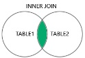

Bibliotecas necessárias:

pip install pandas

sqlite3   -  já vem instalada no python por padrão.

PROBLEMA:

Listar os nomes das vítimas de natureza A20003 que em data posterior foram vítimas na natureza U33004.

U33004 - ATEND. DENUNCIA INFRACOES CONTRA MULHER(VIOLENCIA DOMESTICA)

A20003 - INCLUSAO DA VITIMA E AVALIACAO DE RISCO

OBS: Dados fictícios.

Tabela 1, vítimas natureza A20003.

|nome1|natureza1|data\_fato1|
| :- | :- | :- |
|Maria Clara|A20003|03/04/2022|
|Elenice Silva|A20003|28/05/2021|
|Aline Oliveira|A20003|15/05/2022|
|Jussara de Melo|A20003|11/06/2021|
|Andreza Taylor|A20003|21/05/2022|

Tabela 2, vítimas natureza U33004.

|nome2|natureza2|data\_fato2|
| :- | :- | :- |
|Diana Flores|U33004|04/05/2022|
|Elis Lima|U33004|28/05/2023|
|Aline Oliveira|U33004|25/05/2022|
|Laura da Paz|U33004|21/05/2021|
|Maria Clara|U33004|21/04/2022|
|Andreza Taylor|U33004|05/04/2022|
|Eloisa Assis|U33004|02/08/2023|

DICA: pensar em “JOINS” como preservação ou exclusão de linhas de uma determinada tabela conforme exemplos abaixo.

|

Traz somente linhas iguais nas duas tabelas.
|

Traz as linhas iguais e preserva todas linhas da tabela1.
|

Traz linhas iguais e preserva todas linhas da tabela2.
|
| :-: | :-: | :-: |
|
SELECT coluna

From TABLE1 

INNER JOIN TABLE2

ON TABLE1.key=TABLE2.key
|
SELECT coluna

From TABLE1 

LEFT JOIN TABLE2

ON TABLE1.key=TABLE2.key
|
SELECT coluna

From TABLE1 

RIGHT JOIN TABLE2

ON TABLE1.key=TABLE2.key
|

SELECT nome1 as 'Nome vitima reincidente'

FROM

tabela1 AS t1

INNER JOIN

tabela2 AS t2

ON t1.nome1 = t2.nome2

WHERE t1.data\_fato1 < t2.data\_fato2

RESULTADO:

|Nome vitima reincidente|
| :- |
|Maria Clara|
|Aline Oliveira|

